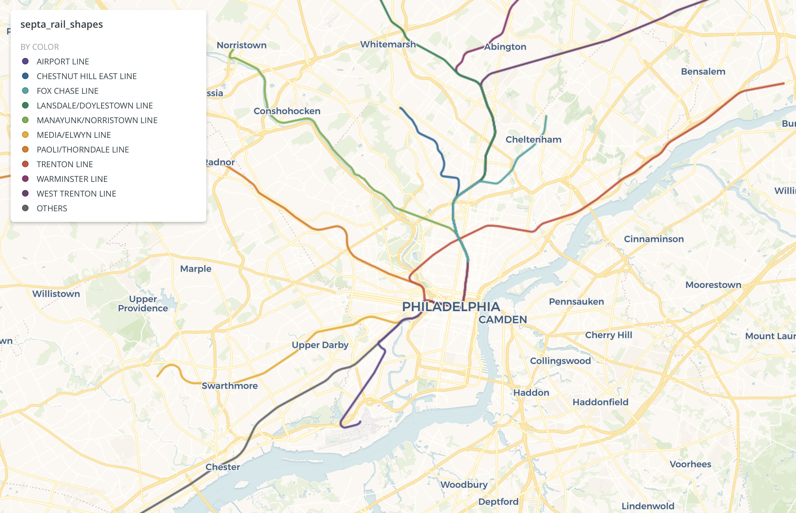

# Lab 4 - PostGIS with GTFS data

We'll continue to use the Septa GTFS data from [Tuesday's Lecture](README.md#Lecture), this time focusing on the rail data. Let's dig into the data a bit more by looking at some of the files.

First, import the data into your Carto account.
* Septa GTFS data: `https://github.com/MUSA-509/week-4-spatial-joins-and-indexes/blob/master/data/septa_gtfs_rail.zip?raw=true`
* OSM buildings for Philadelphia: `https://raw.githubusercontent.com/MUSA-509/week-4-spatial-joins-and-indexes/master/data/philadelphia_osm_buildings.geojson`

**Files** -- I've renamed them to be `septa_gtfs_x`, but GTFS come with standardized names.
* [`shapes.txt`](https://gtfs.org/reference/static/#shapestxt) - geospatial 'shape' of a full trip on any route as a collection of ordered lat/long pairs
  - `shape_id` - unique ID referencing the shape traced out by connecting all points with the same ID ordered by `shape_pt_sequence`. Note: multiple `shape_id`s correspond to a `route_id`. E.g., there may be the same train line but rush-hour service, express service, weekend service, etc.
  - `shape_pt_lat` - latitude of point part of shape
  - `shape_pt_lon` - longitude of point part of shape
* [`trips.txt`](https://gtfs.org/reference/static/#tripstxt)
  - `route_id` - ID of a route
  - `shape_id` - Allows us to associate shapes with routes
* [`routes.txt`](https://gtfs.org/reference/static/#routestxt)
  - `route_id` - unique ID for a route
  - `route_short_name` - short name of the route (e.g., `Green`, `L`, etc.)

## 1. Add geometries to tables

1. `septa_rail_stops`
2. `septa_rail_shapes` -- NOTE, only do UPDATEs for ranges of `cartodb_id`. E.g., add `WHERE cartodb_id between 1 and 40000`, between 40000 and 80000, and 80000 and 102000 (max is a bit over 101k). Otherwise, the operation will timeout due to query limits on Carto's platform.

```SQL
-- add your query here
```

## 2. Create rail routes using the `shapes.txt` table, grouping by appropriate fields. Make sure there is an ORDER BY in the [`ST_MakeLine`](https://postgis.net/docs/ST_MakeLine.html) too.

```SQL
-- add your query here
```

**Note**

To visualize the data, make sure to add `the_geom_webmercator` and `cartodb_id` in the `SELECT` clause. You can probably put your query in the subquery here:

```SQL
SELECT *, ST_Transform(the_geom, 3857) as the_geom_webmercator, row_number() over () as cartodb_id
FROM (
  -- put your query here
) as _w
```

## 3. Using the query from the previous result, find the length of each shape in meters

```SQL
-- put your query here
```

## 4. For each stop, find the number of buildings in Philadelphia county within 800 meters (use 0.008 as an approximation to avoid casting to geography and avoid DB timeouts).

**Note:** Make sure to account for cases where there are no buildings (i.e., outside Philadelphia county).

```SQL
-- put your query here
```

## 5. Create a crosswalk that pairs a `shape_id` with a `route_id`. Build it from the `septa_rail_trips` table.

To keep things simple, let's only pair one `shape_id` with one `route_id`. Use the [`DISTINCT ON()`](https://www.postgresql.org/docs/12/sql-select.html#SQL-DISTINCT) to select only one `shape_id` per `route_id`.

For example, if we had a table like this, `scores`:

```
  name  | score
--------|-------
Banksy  |   5
Andy    |   3
Frannie |   7
Andy    |   4
Frannie |   9
```

We could select the top or bottom scores using `DISTINCT ON` with an `ORDER BY`. Here we get the top scores:

```
SELECT DISTINCT ON(name) name, score
FROM scores
ORDER BY name, score DESC;
```

Apply this to create a query for `shape_id` and `route_id` only from the `septa_rail_trips` table.

```SQL
-- put your query here
```

### 6. Do a sanity check on the previous query.

Using a `GROUP BY`, wrap the previous query as a subquery to make sure there is only one `shape_id` per `route_id`

```SQL
SELECT route_id, COUNT(shape_id)
FROM (
  -- your query from above
) as _w
GROUP BY 1
```

If you wrote the query correctly, `COUNT` should be `1` for each row.

## 7. Now create a rail map




1. Use the query from \#2
2. Join it with the query from \#3
3. Join it again with `septa_rail_routes` table to get the `route_short_name`

Yes, you can have more than one join!

```SQL
SELECT ...
FROM tablea
JOIN tableb
ON ST_Intersects(tablea.geom, tableb.geom)
JOIN tablec
ON tablec.id = tablea.id
```

In the `SELECT`, make sure to have:

1. Linestring of the routes (geometry)
2. `shape_id`
3. `route_id`
4. `route_short_name`

```SQL
-- write your query here
```
